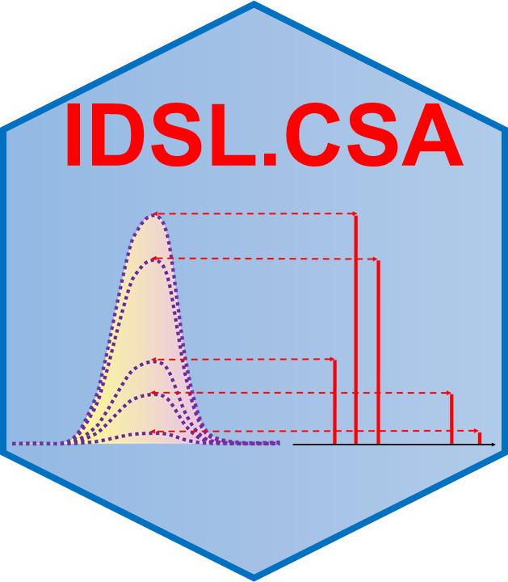

# IDSL.CSA 

<!-- badges: start -->

<!-- badges: end -->

**Composite Spectra Analysis (CSA)** by the [**Integrated Data Science Laboratory for Metabolomics and Exposomics (IDSL.ME)**](https://www.idsl.me/) is an R package designed to deconvolute fragmentation spectra from Composite Spectra Analysis (CSA), Data Dependent Acquisition (DDA), and various Data-Independent Acquisition (DIA) methods such as MSE, and All-Ion Fragmentation (AIF).

	install.packages("IDSL.CSA") # IDSL.CSA package is set to release on CRAN on Jan 10 2022

## Workflow
Prior to processing your mass spectrometry data (**mzXML**, **mzML**, **netCDF**) using the IDSL.CSA workflow, mass spectrometry data should be processed using the [IDSL.IPA](https://github.com/idslme/IDSL.IPA) workflow to acquire chromatographic information of the peaks (***m/z-RT***). When the chromatographic information of individual and aggregated aligned peaklists were generated using the [IDSL.IPA](https://github.com/idslme/IDSL.IPA) workflow, download the [IDSL.CSA parameter spreadsheet](https://raw.githubusercontent.com/idslme/IDSL.CSA/main/CSA_parameters.xlsx) and select the parameters accordingly and then use this spreadsheet as the input for the IDSL.CSA workflow:

	library(IDSL.FSA)
	library(IDSL.CSA)
	IDSL.CSA_workflow("Address of the CSA parameter spreadsheet")

Visit [**wiki**](https://github.com/idslme/IDSL.CSA/wiki) for the detailed documentations and tutorials on different processing types for [**CSA analysis by IDSL.CSA**](https://github.com/idslme/IDSL.CSA/wiki/CSA-analysis-by-IDSL.CSA), [**DDA analysis by IDSL.CSA**](https://github.com/idslme/IDSL.CSA/wiki/DDA-analysis-by-IDSL.CSA), and [**DIA analysis by IDSL.CSA**](https://github.com/idslme/IDSL.CSA/wiki/DIA-analysis-by-IDSL.CSA).

## Citation

pending...